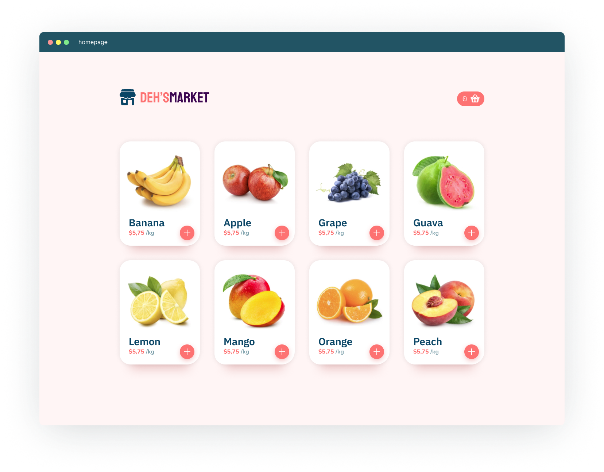
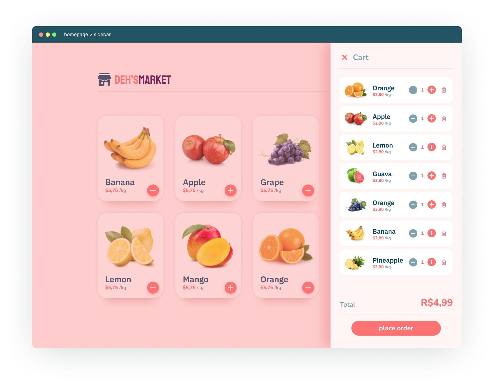
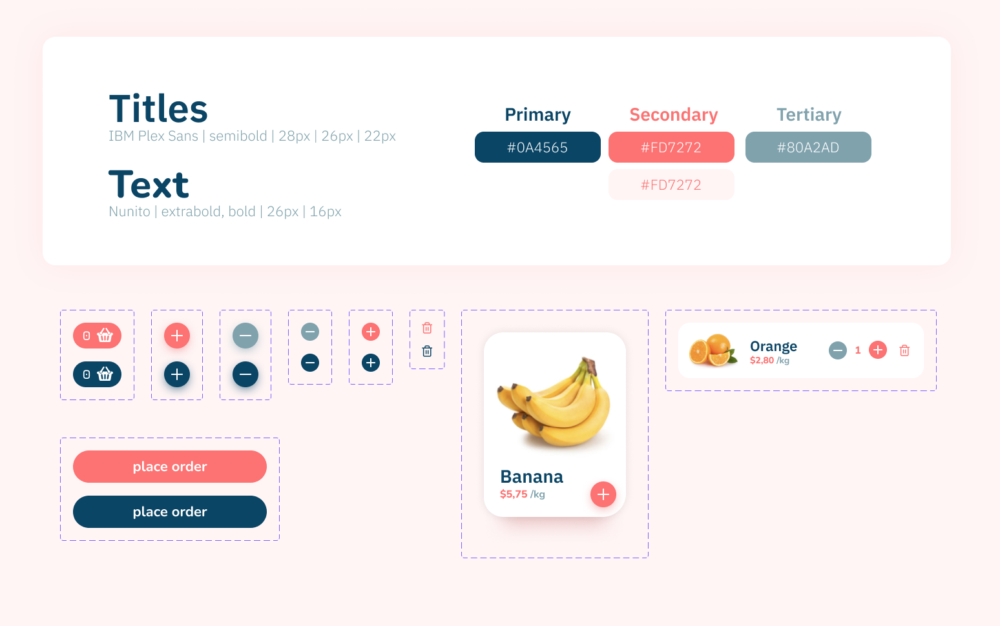

[](https://www.gnu.org/licenses/gpl-3.0)

# Summary

<!--ts-->

- [Purpose](#purpose)
- [Installation](#installation)
- [Original Content](#original-content)
- [Using MirageJS](#using-miragejs)
- [Acknowledgment](#acknowledgment)
- [Techs and Libs](#techs-and-libs)

<!--te-->

# Purpose

Originally, [<b>Deh's Market</b>](https://github.com/dehcastro/dehsmarket) was created to support TDD learning. The original application had its styles already done (even thought we changed them a bit) so we could focus on using TDD to implement its functionalities.

However, we changed the concept a bit, and, instead of only practicing TDD, we wanted to create an entire application with [accessibility first](https://www.24a11y.com/2017/accessibility-first/) in mind. In order to show to other people that it is possible to develop a great product while still striving for accessibility.

# Installation

```shell

yarn

// or npm install

```

after installed ...

```shell

yarn dev

// or npm run dev

```

# Original Content

Feel free to improve and include more complexity. Here's the original Figma link: https://www.figma.com/file/Ra9QIH91rs3okS9wb6SqIL/deh'smarket?node-id=0%3A1





# Using MirageJS

[MirageJS](https://github.com/miragejs/miragejs) is a client-side server to develop, test and prototype JavaScript apps.

Here it is how we're using [MirageJS](https://github.com/miragejs/miragejs) in our application:

```
├── miragejs
|   ├── products.ts
|   ├── server.ts
```

In the `products.ts` file we have an array with 9 products.

In the `server.ts` we're telling our application to render 9 products by default when it's running in development environment.

<br />

How to config our application to use [MirageJS](https://github.com/miragejs/miragejs):

```typescript
// pages/_app.tsx

import { startMirageServer } from '../miragejs/server'

if (process.env.NODE_ENV === 'development') {
  startMirageServer({ environment: 'development' })
}

function MyApp({ Component, pageProps }: AppProps) {
  // [...]
}
```

<br />

How to use [MirageJS](https://github.com/miragejs/miragejs) in our test files:

```typescript
// test files

import { Server } from 'miragejs'
import { startMirageServer } from '../miragejs/server'

describe('Test Suit', () => {
  let server: Server

  beforeEach(() => {
    server = startMirageServer({ environment: 'test' })
  })

  afterEach(() => {
    server.shutdown()
  })

  it('test with a single product', async () => {
    server.create('product')

    // [...]
  })

  it('test with a list of products', async () => {
    server.createList('product', 3)

    // [...]
  })
})
```

Check out [MirageJS](https://github.com/miragejs/miragejs) documentation for more.

# Acknowledgment

We would like to thanks @dehcastro for the template, and also for the learning initiative. It certainly was an important starting point for us!

# Techs and Libs

- [axios](https://github.com/axios/axios)
- [next](https://github.com/vercel/next.js)
- [react-icons](https://github.com/react-icons/react-icons)
- [styled-components](https://github.com/styled-components/styled-components)
- [jest](https://github.com/facebook/jest)
- [miragejs](https://github.com/miragejs/miragejs)
- [typescript](https://github.com/Microsoft/TypeScript)
